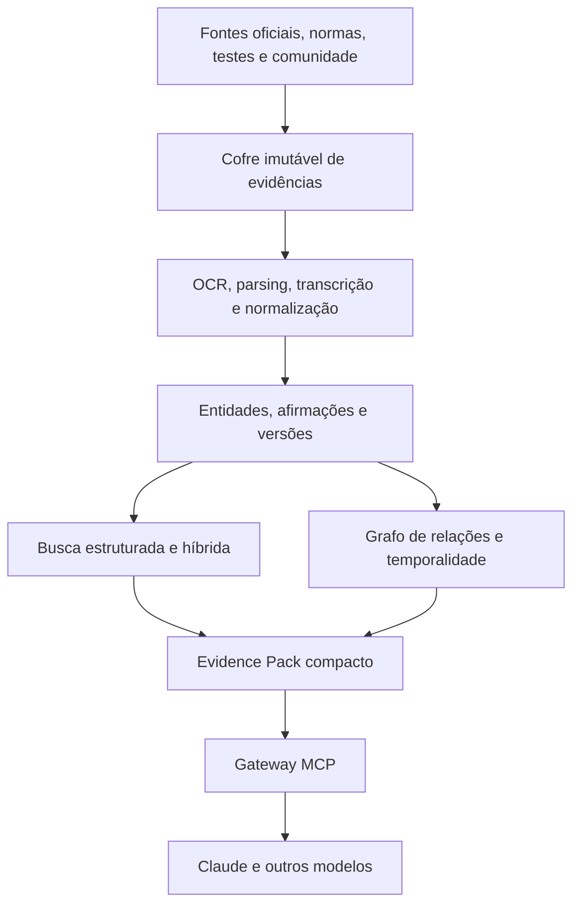

# Cérebro Audiovisual — Plano Mestre de Pesquisa, Arquitetura e Implantação

**Status:** documento de planejamento para avaliação externa  
**Data-base da pesquisa:** 23 de julho de 2026  
**Fase atual:** pesquisa e definição arquitetural — nenhuma implantação autorizada  
**Projeto:** iniciativa nova, independente e isolada  
**Destinatário desta versão:** Fable, para análise crítica

---

## 1. Solicitação de avaliação ao Fable

Este documento propõe a criação de um cérebro técnico de audiovisual: um repositório real, versionado, auditável e pesquisável, capaz de fornecer ao Claude apenas o contexto necessário para cada pergunta.

O objetivo da avaliação não é confirmar educadamente o plano. O Fable deve tentar encontrar fragilidades, complexidade desnecessária, tecnologias inadequadas, riscos jurídicos, pontos de lock-in e maneiras mais simples ou modernas de atingir o mesmo resultado.

### Perguntas que o Fable deve responder

1. A arquitetura em camadas é adequada ou existe uma solução mais simples que preserve a mesma qualidade?
2. Graphify está recebendo o papel correto ou deveria ter mais/menos importância?
3. RAGFlow é o melhor motor intermediário para o piloto, ou Docling + Qdrant, Neo4j, Weaviate, OpenSearch, LlamaIndex, LightRAG ou outra tecnologia atual entregaria mais valor?
4. Obsidian + Git + Markdown/JSON é uma fonte canônica sustentável para anos de crescimento?
5. O modelo baseado em afirmações atômicas e evidências é suficientemente rigoroso?
6. O que está excessivamente complexo para a primeira fase?
7. O que está simplificado demais para um projeto enciclopédico?
8. A estratégia de baixo consumo de tokens no Claude está correta?
9. Como melhorar a ingestão de manuais com tabelas, diagramas, imagens, pinagens e interfaces?
10. Como tratar fóruns, Reddit e YouTube sem perder experiência prática e sem criar riscos jurídicos?
11. Quais benchmarks devem decidir objetivamente entre busca híbrida, Graphify, GraphRAG, LightRAG e Graphiti?
12. Quais tecnologias emergentes de 2026 deveriam ser testadas e não estão contempladas?
13. É melhor adotar RDF/JSON-LD e ontologias formais desde o início, ou manter um modelo mais simples?
14. Como garantir que o sistema continue portátil entre Claude, ChatGPT, Gemini e modelos futuros?
15. Que plano alternativo o Fable recomendaria?

### Tipo de resposta desejada do Fable

- Crítica fundamentada por seção.
- Identificação dos cinco maiores riscos.
- Identificação das cinco melhores decisões.
- Arquitetura alternativa, caso discorde da proposta.
- Tecnologias que devem entrar no benchmark.
- Sugestões de simplificação.
- Sugestões de expansão.
- Veredito: aprovar, aprovar com alterações ou redesenhar.

---

## 2. Visão do projeto

O projeto pretende construir uma base de conhecimento audiovisual próxima de uma combinação entre:

- biblioteca técnica;
- Wikipédia;
- Wikidata;
- mecanismo de busca;
- grafo de conhecimento;
- banco de compatibilidades;
- sistema de troubleshooting;
- conjunto de calculadoras;
- pesquisador técnico operado por IA.

O cérebro deverá conhecer não apenas documentos, mas também as relações entre produtos, versões, padrões, protocolos, procedimentos e limitações.

Exemplos de perguntas futuras:

- Quais câmeras oferecem determinada combinação de resolução, frame rate, codec e bit depth?
- Uma lente cobre determinado sensor em open gate, com qual nível de vinheta?
- Quais adaptadores preservam metadata, servo ou alimentação?
- Um switcher aceita o sinal de uma câmera em determinado formato?
- Quando um firmware alterou uma limitação?
- Qual processadora comporta determinada configuração de painel?
- Quais fatores podem causar flicker ou linhas de varredura em LED?
- Qual largura de banda é necessária para um workflow multicâmera?
- Quanto tempo de gravação cabe em determinada mídia?
- Quais normas e práticas se aplicam a uma instalação elétrica ou rigging?
- O que o fabricante declara e o que testes independentes observaram?
- Há relatos comunitários que contradizem a documentação oficial?

---

## 3. Princípio central

O cérebro não deve ser uma pasta gigantesca de PDFs vetorizados.

A unidade fundamental do conhecimento deve ser:

> **uma afirmação técnica atômica, acompanhada de escopo, versão, contexto, fonte, localização exata, procedência e estado de confiabilidade.**

“A câmera grava 120 fps” não é uma afirmação suficiente.

O registro correto precisa responder:

- em qual resolução;
- em qual área do sensor;
- com ou sem crop;
- em qual codec;
- em qual bit depth e chroma;
- em qual mídia;
- com qual firmware;
- com quais limitações;
- em qual região;
- segundo qual documento;
- em qual página, tabela ou seção;
- se foi declarado, medido ou apenas relatado.

Esse princípio orienta todo o projeto.

---

## 4. O que o sistema não deve ser

### Não deve ser apenas um vault do Obsidian

O Obsidian é uma excelente interface editorial, mas suas relações são principalmente links entre notas. Isso não equivale a uma ontologia técnica com compatibilidades condicionais, versões, conflitos e evidências.

### Não deve ser apenas NotebookLM/Gemini Notebook

NotebookLM é excelente para investigar um conjunto limitado de fontes, mas cria unidades de trabalho separadas, possui limites por notebook e não oferece o controle necessário sobre índice, versionamento, automação, grafo e integração nativa com o Claude.

### Não deve ser apenas um Claude Project

Claude Projects possui RAG nativo e pode servir como prova de conceito. O repositório definitivo, porém, não deve depender de uploads manuais, indexação opaca ou de um único fornecedor.

### Não deve ser apenas Graphify

Graphify é promissor para compilar e navegar relações, mas não deve ser a única representação persistente, o único mecanismo de recuperação ou a fonte canônica.

### Não deve ser somente busca vetorial

Embeddings são bons para ideias semelhantes e paráfrases, mas podem falhar em:

- códigos de produto;
- números de firmware;
- conectores;
- bitrates;
- resoluções;
- pinagens;
- nomes de codecs;
- versões;
- medidas;
- siglas.

### Não deve tentar “treinar” o Claude com todos os documentos

O conhecimento técnico muda. Firmware, software, normas e compatibilidades evoluem. O objetivo é recuperação externa atualizável, não fine-tuning para memorizar fatos.

### Não deve ingerir a internet inteira

Volume sem curadoria cria ruído, duplicações, marketing disfarçado, relações falsas e piora da recuperação. Descoberta pode ser ampla; promoção ao conhecimento canônico deve ser criteriosa.

---

## 5. Princípios arquiteturais

1. **Portabilidade:** o conhecimento não pode depender de um único aplicativo.
2. **Fonte canônica separada dos índices:** índices devem ser descartáveis e reconstruíveis.
3. **Evidência antes da síntese:** toda afirmação importante precisa apontar para uma fonte.
4. **Temporalidade:** firmware, versões e normas precisam de validade temporal.
5. **Contradição preservada:** fontes conflitantes não devem ser silenciosamente fundidas.
6. **Recuperação progressiva:** o Claude recebe pouco contexto primeiro e expande apenas quando necessário.
7. **Busca híbrida:** lexical, semântica, estruturada e relacional.
8. **Cálculo determinístico:** fórmulas não devem ser resolvidas por memória textual.
9. **Separação de autoridade:** manual, laboratório e fórum não possuem o mesmo papel.
10. **Revisão proporcional ao risco:** elétrica, rigging, RF, segurança, drones e jurídico exigem maior rigor.
11. **Isolamento:** este projeto nasce com repositório, armazenamento, namespace, credenciais e MCP próprios.
12. **Neutralidade de modelo:** Claude é o primeiro cliente, não o proprietário do conhecimento.

---

## 6. Arquitetura conceitual



### 6.1. Cofre de evidências

Armazena os materiais originais, quando os direitos permitirem:

- PDFs;
- HTML;
- documentação;
- normas;
- release notes;
- firmware notes;
- imagens;
- diagramas;
- white papers;
- planilhas;
- datasets;
- áudio;
- vídeo;
- transcrições permitidas;
- snapshots de páginas permitidos.

Cada item deve ter:

- ID estável;
- URL canônica;
- publisher;
- autor;
- tipo da fonte;
- idioma;
- jurisdição;
- data de publicação;
- data de captura;
- edição/revisão;
- hash do binário;
- hash do texto extraído;
- licença;
- permissões de uso;
- produto, software, firmware ou norma cobertos.

Os originais não são editados. Novas versões criam novos registros.

### 6.2. Repositório canônico

Deve conter o conhecimento curado e ser versionado em Git.

Formatos iniciais:

- Markdown para páginas, explicações e workflows.
- YAML para metadados simples.
- JSON/JSONL para afirmações e estruturas complexas.
- CSV/Parquet para tabelas e análises em volume, quando necessário.

Estrutura conceitual:

```text
av-knowledge/
├── README.md
├── constitution/
│   ├── principles.md
│   ├── source-policy.md
│   ├── rights-policy.md
│   └── editorial-policy.md
├── ontology/
│   ├── entity-types.yaml
│   ├── relation-types.yaml
│   ├── claim-schema.json
│   ├── source-schema.json
│   ├── controlled-vocabularies/
│   └── validation-rules/
├── entities/
│   ├── brands/
│   ├── products/
│   ├── standards/
│   ├── protocols/
│   ├── software/
│   └── concepts/
├── claims/
│   ├── official/
│   ├── empirical/
│   ├── community/
│   └── unresolved/
├── compatibility/
├── workflows/
├── troubleshooting/
├── calculators/
├── canonical-capsules/
├── source-manifests/
├── evaluations/
└── coverage/
```

Arquivos binários grandes não precisam ficar dentro do Git. O Git guarda o manifesto e o conhecimento; o cofre guarda os originais.

### 6.3. Índices derivados

Podem incluir:

- full-text/BM25;
- embeddings densos;
- vetores esparsos;
- índices de metadata;
- reranking;
- grafo Graphify;
- banco Neo4j;
- índice temporal;
- resumos de comunidades GraphRAG.

Todos devem ser regeneráveis a partir do cofre e do repositório canônico.

### 6.4. Gateway MCP

O MCP não é o banco. É a interface controlada entre o cérebro e o Claude.

Ferramentas propostas:

```text
av_search
av_get_entity
av_compare
av_trace_relation
av_get_evidence
av_get_source_section
av_get_history
av_calculate
av_report_gap
```

O MCP deve:

- impedir consultas arbitrárias perigosas;
- aplicar filtros;
- controlar orçamento de tokens;
- entregar citações;
- registrar a versão do corpus;
- expor contradições;
- indicar evidência ausente;
- permitir expansão paginada;
- evitar que o Claude receba o corpus inteiro.

---

## 7. Papel das tecnologias

### 7.1. Obsidian

Papel:

- editor humano;
- navegador;
- páginas enciclopédicas;
- backlinks;
- taxonomia visível;
- revisão;
- dashboards editoriais.

Decisão:

- utilizar como superfície de trabalho;
- não utilizar como único banco estruturado;
- manter os dados em formatos legíveis fora do aplicativo.

Referências:

- [Obsidian Properties](https://obsidian.md/help/properties)
- [Obsidian Bases](https://obsidian.md/help/bases)

### 7.2. Zotero

Papel:

- captura de fontes;
- PDFs;
- autoria;
- datas;
- URLs;
- notas;
- citações;
- bibliografia;
- deduplicação bibliográfica.

Decisão:

- usar como catálogo de pesquisa;
- sincronizar IDs de fontes com o repositório;
- não torná-lo responsável pela ontologia.

Referência:

- [Zotero — arquivos e anexos](https://www.zotero.org/support/attaching_files)

### 7.3. NotebookLM/Gemini Notebook

Papel:

- laboratório de leitura;
- pesquisa focada por tema;
- comparação de um conjunto delimitado;
- geração de perguntas;
- descoberta de lacunas.

Decisão:

- usar em sprints de pesquisa;
- exportar as conclusões aprovadas para o repositório canônico;
- não usar como fonte definitiva.

Referência:

- [Limites oficiais do Gemini Notebook](https://support.google.com/gemininotebook/answer/16269187?hl=en)

### 7.4. Claude Projects

Papel:

- prova de conceito;
- interação inicial;
- validação de fichas e documentos;
- comparação com o MCP futuro.

Decisão:

- usar apenas como ambiente experimental;
- não depender de sua indexação como infraestrutura permanente.

Referência:

- [RAG em Claude Projects](https://support.anthropic.com/en/articles/11473015-retrieval-augmented-generation-rag-for-projects)

### 7.5. Graphify

Capacidades relevantes:

- documentos;
- PDFs;
- imagens;
- áudio;
- vídeo;
- YouTube;
- graph.json;
- Obsidian;
- Neo4j;
- FalkorDB;
- MCP;
- consultas de caminho, vizinhança e explicação.

Pontos fortes:

- rápido para um piloto;
- representação compacta de conexões;
- integração direta com Claude Code;
- rastreabilidade de arestas extraídas e inferidas;
- saída local e portátil.

Riscos:

- projeto jovem e de evolução rápida;
- vantagem determinística maior em código do que em documentos;
- extração de documentos e mídia depende de LLM;
- formato de grafo não substitui banco canônico;
- benchmarks próprios;
- possibilidade de ruído sem ontologia controlada;
- inconsistência conceitual entre materiais que o descrevem como “sem vector store” e benchmarks recentes com recuperação híbrida.

Decisão:

> Usar Graphify como compilador, navegador e experimento de recuperação sobre a camada curada. Não torná-lo a única fonte de verdade.

Referências:

- [Graphify](https://github.com/Graphify-Labs/graphify)
- [Benchmarks publicados pelo projeto](https://github.com/Graphify-Labs/graphify/blob/v8/BENCHMARKS.md)

### 7.6. RAGFlow

Papel:

- motor intermediário;
- parsing de documentos;
- OCR;
- chunking inspecionável;
- busca;
- reranking;
- citações;
- GraphRAG opcional;
- MCP.

Pontos fortes:

- reduz o trabalho para obter um RAG funcional;
- permite testar documentos reais antes de construir plataforma própria;
- interface para revisar chunks.

Riscos:

- infraestrutura mais pesada;
- produto ainda em rápida evolução;
- recursos de grafo consomem memória, processamento e tokens;
- não deve possuir a única cópia dos dados.

Decisão:

- candidato principal ao piloto intermediário;
- comparar com Docling + Qdrant;
- mantê-lo substituível.

Referências:

- [RAGFlow MCP](https://ragflow.io/docs/launch_mcp_server)
- [RAGFlow Knowledge Graph](https://ragflow.io/docs/construct_knowledge_graph)

### 7.7. Docling e MinerU

Papel:

- parsing de PDF;
- leitura de layout;
- tabelas;
- fórmulas;
- OCR;
- imagens;
- reading order;
- saída estruturada.

Decisão:

- avaliar ambos com manuais audiovisuais reais;
- não escolher apenas por benchmark genérico;
- testar tabelas de codec, pinagens, diagramas, páginas em múltiplas colunas e PDFs escaneados.

Referências:

- [Docling](https://docling-project.github.io/docling/)
- [MinerU](https://github.com/opendatalab/MinerU)

### 7.8. Qdrant

Papel:

- busca híbrida;
- dense embeddings;
- BM25/sparse;
- filtros;
- fusão;
- reranking;
- recuperação em escala.

Decisão:

- candidato principal para a plataforma custom;
- pode entrar já no benchmark;
- não substitui um grafo de relações.

Referência:

- [Qdrant Hybrid Search with Reranking](https://qdrant.tech/documentation/tutorials-basics/reranking-hybrid-search/)

### 7.9. Neo4j

Papel:

- ontologia operacional;
- compatibilidades;
- caminhos;
- versões;
- relações qualificadas;
- conflitos;
- proveniência;
- consultas Cypher.

Decisão:

- acrescentar quando o schema estiver estabilizado;
- evitar modelar toda a ontologia prematuramente;
- considerar começar somente com seus índices vetoriais/full-text se a operação de dois bancos for excessiva.

### 7.10. Graphiti

Papel:

- fatos temporais;
- validade;
- evolução;
- atualização incremental;
- firmware;
- substituição;
- memória de acontecimentos.

Decisão:

- testar quando o corpus possuir histórico suficiente;
- comparar com temporalidade implementada diretamente no Neo4j;
- não assumir que uma solução criada para memória de agentes resolverá automaticamente a enciclopédia técnica.

Referência:

- [Graphiti](https://help.getzep.com/graphiti/getting-started/welcome)

### 7.11. Microsoft GraphRAG

Papel:

- sínteses globais;
- comunidades;
- mapas de um domínio;
- perguntas abrangentes;
- identificação de temas e lacunas.

Não é o caminho padrão para:

- firmware exato;
- pinagem;
- especificação;
- código de produto;
- comparação tabular simples.

Decisão:

- usar offline e sob demanda;
- comparar global/local/DRIFT com baseline híbrido.

Referência:

- [Microsoft GraphRAG](https://microsoft.github.io/graphrag/)

### 7.12. LightRAG

Papel:

- experimento graph-enhanced;
- recuperação local/global;
- grafo e vetores;
- atualizações incrementais.

Decisão:

- incluir no benchmark;
- nunca usar seu formato interno como única representação.

Referência:

- [LightRAG](https://github.com/HKUDS/LightRAG)

---

## 8. Modelo de conhecimento

### 8.1. Entidades iniciais

- fabricante;
- organização;
- família de produtos;
- modelo;
- variante;
- componente;
- porta;
- interface;
- acessório;
- mount;
- sensor;
- lente;
- formato;
- codec;
- perfil;
- container;
- mídia;
- protocolo;
- standard;
- firmware;
- software;
- release;
- plugin;
- sistema operacional;
- GPU;
- workflow;
- função profissional;
- técnica;
- cálculo;
- sintoma;
- causa;
- teste;
- correção;
- risco;
- fonte;
- trecho;
- afirmação;
- conflito;
- compatibilidade.

### 8.2. Relações iniciais

```text
HAS_FAMILY
HAS_VARIANT
HAS_COMPONENT
USES_MOUNT
HAS_INTERFACE
SUPPORTS
REQUIRES
OUTPUTS
INPUTS
CONVERTS_TO
COMPATIBLE_WITH
INCOMPATIBLE_WITH
LIMITED_BY
DEPENDS_ON
COMPLIES_WITH
REPLACED_BY
SUPERSEDES
TESTED_WITH
OBSERVED_IN
DOCUMENTED_IN
RECOMMENDED_FOR
NOT_RECOMMENDED_FOR
CAUSES
INDICATES
TESTED_BY
RESOLVED_BY
CONTRADICTS
CORROBORATES
DERIVED_FROM
VALID_DURING
```

### 8.3. Afirmação atômica

Modelo conceitual:

```yaml
id: claim:example-001
subject: equipment:camera-x
predicate: supports
object: format:codec-y

value_original: "Texto como aparece na fonte"
value_normalized: true

scope:
  model_variant: global
  firmware_min: "1.2"
  firmware_max: null
  sensor_mode: full
  resolution: "3840x2160"
  frame_rate: "59.94"
  bit_depth: 10
  chroma: "4:2:2"
  media: "media-z"
  output: "interface-a"
  external_device: null
  region: global

evidence:
  source_id: source:manual-123
  locator_type: page_and_table
  locator: "p. 143, tabela 8"
  fragment_hash: sha256:example
  extraction_method: docling
  extraction_confidence: 0.98

provenance:
  evidence_type: manufacturer_manual
  directness: primary
  sponsored: false
  translation: false

validity:
  valid_from: 2026-04-10
  valid_to: null
  status: current

curation:
  state: verified
  reviewer: null
  reviewed_at: null
  next_review: null
```

### 8.4. Compatibilidade como entidade

Uma aresta simples `A COMPATIBLE_WITH B` é fraca.

A compatibilidade deve poder representar:

- produto A;
- produto B;
- adaptador;
- mount;
- alimentação;
- protocolo;
- recurso desejado;
- firmware A;
- firmware B;
- condição de funcionamento;
- suporte oficial ou não oficial;
- teste realizado;
- resultado;
- limitações;
- evidências;
- data.

### 8.5. Conflitos

O sistema deve criar um `conflict_group` quando duas fontes parecem discordar.

Fluxo:

1. Determinar se o conflito é real.
2. Comparar método e escopo.
3. Preservar ambas as afirmações.
4. Registrar a provável razão da divergência.
5. Produzir uma conclusão canônica somente se houver base.
6. Manter a conclusão versionada.

Exemplos de falsos conflitos:

- latitude declarada e latitude medida com critério de SNR;
- “full frame coverage” sem especificação da diagonal;
- refresh rate sem scan, PWM, shutter e brilho;
- suporte oficial comparado a workaround não oficial.

### 8.6. Confiança multidimensional

Evitar um único número de confiança.

Guardar dimensões separadas:

- autoridade;
- proximidade da evidência;
- adequação ao escopo;
- atualidade;
- independência;
- reprodutibilidade;
- transparência da metodologia;
- corroboração;
- qualidade da extração;
- revisão humana.

---

## 9. Ontologias e padrões que podem ser reaproveitados

Não é necessário começar com uma implementação RDF completa, mas o modelo deve se inspirar em padrões existentes:

- [W3C PROV-O](https://www.w3.org/TR/prov-o/) — proveniência.
- [SKOS](https://www.w3.org/TR/skos-reference/) — taxonomia, conceitos, aliases e idiomas.
- [QUDT](https://www.qudt.org/) — unidades, grandezas e conversões.
- [Dublin Core Terms](https://www.dublincore.org/specifications/dublin-core/dcmi-terms/) — documentos e fontes.
- [Schema.org Product](https://schema.org/Product) — produtos e propriedades.
- [PBCore](https://pbcore.org/) — catalogação audiovisual.
- [EBUCore](https://www.ebu.ch/metadata/ontologies/ebucore/) — media assets e enterprise.
- [IPTC Video Metadata Hub](https://iptc.org/standards/video-metadata-hub/) — metadata de vídeo.
- [MovieLabs Ontology for Media Creation](https://mc.movielabs.com/docs/ontology/) — produção e media creation.
- [SPDX](https://spdx.dev/) — identificação de licenças.
- [C2PA](https://c2pa.org/) — autenticidade e proveniência de mídia.
- [ASC MHL](https://mediahashlist.org/) — integridade e cadeia de custódia.

Questão para o benchmark:

> É melhor armazenar o canônico como JSON/JSONL com IDs estáveis e gerar RDF depois, ou adotar JSON-LD/RDF desde o início?

---

## 10. Arquitetura de recuperação

### 10.1. Tipos de pergunta

| Tipo | Exemplo genérico | Mecanismo |
|---|---|---|
| Exata | “Qual firmware adicionou o recurso X?” | Metadata + BM25 |
| Numérica | “Qual bitrate neste modo?” | Estruturado + trecho oficial |
| Semântica | “Por que esse workflow gera maior latência?” | Dense retrieval |
| Comparação | “Compare A e B nas dimensões X, Y e Z” | Fichas estruturadas + evidências |
| Compatibilidade | “A funciona com B nesta condição?” | Grafo + afirmações |
| Temporal | “Isso continua válido?” | Grafo temporal |
| Troubleshooting | “Quais causas produzem este sintoma?” | Grafo diagnóstico + comunidade |
| Global | “Quais tendências conectam esta área?” | GraphRAG/comunidades |
| Cálculo | “Quanto storage/energia/rede é necessário?” | Ferramenta determinística |

### 10.2. Pipeline de consulta

1. Interpretar a pergunta.
2. Identificar entidades e aliases.
3. Classificar o tipo de consulta.
4. Aplicar filtros:
   - marca;
   - modelo;
   - variante;
   - versão;
   - firmware;
   - data;
   - idioma;
   - país;
   - source tier.
5. Buscar em paralelo:
   - structured/metadata;
   - BM25/sparse;
   - dense embeddings;
   - grafo, se necessário.
6. Fundir rankings.
7. Reranquear candidatos.
8. Remover duplicações e republicações.
9. Montar um Evidence Pack.
10. Entregar ao Claude.
11. Permitir expansão.
12. Registrar métricas e feedback.

### 10.3. Evidence Pack

Exemplo:

```json
{
  "corpus_version": "2026.07.23",
  "query_type": "compatibility",
  "entities": [],
  "claims": [],
  "contradictions": [],
  "sources": [],
  "missing_evidence": [],
  "warnings": [],
  "token_budget_used": 2140,
  "next_cursor": null
}
```

O primeiro pacote deve ser curto. Faixa inicial a validar:

- 5 a 10 afirmações;
- 5 a 8 trechos;
- 1.500 a 3.000 tokens;
- expansão sob demanda.

### 10.4. Estratégias de economia de tokens

- Não carregar manuais inteiros.
- Não colocar a taxonomia completa no prompt.
- Usar tool search/deferred MCP tools.
- Retornar IDs e resumos antes dos trechos completos.
- Usar parent-child retrieval.
- Localizar com chunks pequenos e responder com a seção-pai.
- Remover duplicações.
- Reaproveitar fichas compactas.
- Cachear perguntas contra a versão do corpus.
- Filtrar e calcular fora da janela do Claude.
- Usar programmatic tool calling quando houver múltiplas consultas.
- Entregar citações estruturadas.
- Limpar resultados antigos em conversas longas.

Referências Claude:

- [MCP e tool search](https://docs.anthropic.com/en/docs/claude-code/mcp)
- [Programmatic tool calling](https://docs.anthropic.com/en/docs/agents-and-tools/tool-use/programmatic-tool-calling)
- [Search result blocks e citações](https://docs.anthropic.com/en/docs/build-with-claude/search-results)
- [Context windows](https://docs.anthropic.com/en/docs/build-with-claude/context-windows)

---

## 11. Calculadoras como parte do cérebro

O projeto deve possuir ferramentas determinísticas versionadas e testadas.

### 11.1. Captura e mídia

- bitrate;
- data rate;
- duração de gravação;
- espaço total;
- overhead;
- redundância;
- velocidade mínima de mídia;
- estimativa de transferência.

### 11.2. Óptica

- field of view;
- crop;
- equivalência;
- image circle;
- profundidade de campo;
- hiperfocal;
- magnificação;
- exposição e transmissão.

### 11.3. Elétrica

- potência;
- corrente;
- fase;
- balanceamento;
- headroom;
- fator de potência;
- autonomia;
- gerador;
- queda de tensão;
- dimensionamento preliminar.

Aviso: cálculos não substituem projeto ou validação de profissional habilitado.

### 11.4. LED

- quantidade de gabinetes;
- pixels totais;
- resolução;
- receiving cards;
- portas;
- carga por porta;
- largura de banda;
- potência;
- brilho;
- relação entre frame rate, shutter, scan e refresh.

### 11.5. Redes

- bandwidth;
- overhead de protocolo;
- links;
- multicast;
- redundância;
- SMPTE ST 2022-7;
- NDI;
- SRT;
- RIST;
- Dante/AES67;
- ST 2110.

### 11.6. Áudio, timecode e sync

- delay;
- distância e tempo;
- frames e amostras;
- conversão 23.976/24/25/29.97/30/50/59.94/60;
- drift;
- latência de pipeline;
- offset.

### 11.7. RF

- frequências;
- canais;
- intermodulação;
- espaçamento;
- potência;
- país e regulamentação.

Questão a avaliar:

> As calculadoras devem estar no mesmo MCP ou em um servidor MCP separado?

---

## 12. Mapa de conhecimento

### 12.1. Fundamentos e ciência da imagem

- exposição;
- sensitometria;
- densidade;
- latitude;
- dynamic range;
- signal-to-noise;
- ISO/EI;
- sensores;
- photosites;
- rolling/global shutter;
- debayer;
- resolução;
- MTF;
- aliasing;
- moiré;
- bit depth;
- chroma subsampling;
- gamma;
- curvas Log;
- colorimetria;
- gamut;
- HDR;
- tone mapping;
- metamerismo;
- codecs;
- compressão;
- containers;
- metadata.

### 12.2. Câmeras

Marcas e ecossistemas iniciais:

- ARRI;
- RED/Nikon;
- Sony;
- Canon;
- Blackmagic Design;
- Panasonic;
- Fujifilm;
- DJI;
- Vision Research;
- Freefly;
- GoPro;
- Insta360;
- sistemas PTZ de Sony, Canon, Panasonic, BirdDog e outros.

Para cada modelo:

- variantes;
- sensor;
- modos;
- resolução;
- frame rates;
- codecs;
- bit depth;
- chroma;
- rolling shutter;
- latitude declarada e medida;
- mounts;
- outputs;
- timecode;
- genlock;
- interfaces;
- metadata;
- mídia;
- energia;
- acessórios;
- firmware;
- known issues;
- compatibilidades.

### 12.3. Lentes e óptica

- Cooke;
- ZEISS;
- ARRI;
- Angénieux;
- Leitz;
- Canon;
- Fujinon;
- Sigma;
- Tokina;
- DZOFilm;
- Atlas;
- Laowa;
- Schneider;
- Hawk;
- Panavision, quando houver documentação utilizável;
- fabricantes vintage e rehousing.

Dados:

- focal;
- T-stop;
- image circle;
- mount;
- flange depth;
- peso;
- dimensões;
- close focus;
- front diameter;
- breathing;
- distorção;
- MTF;
- transmissão;
- vinheta;
- cobertura por sensor mode;
- servo;
- metadata;
- protocolos;
- compatibilidade de extenders.

### 12.4. Movimento, suporte e robótica

- tripés;
- fluid heads;
- Steadicam;
- gimbals;
- DJI;
- Freefly;
- cranes;
- jibs;
- dollies;
- sliders;
- cable cams;
- motion control;
- robótica;
- PTZ;
- tracking;
- underwater;
- high speed;
- aerial;
- macro.

### 12.5. Iluminação

- ARRI Lighting;
- Aputure;
- Nanlux;
- Nanlite;
- Astera;
- Creamsource;
- Kino Flo;
- Litepanels;
- ETC;
- Dedolight;
- DMG/Rosco;
- LEE;
- Chimera;
- DoPchoice;
- LumenRadio.

Conhecimento:

- fotometria;
- espectro;
- SSI;
- TLCI;
- CRI;
- TM-30;
- CCT;
- tint;
- flicker;
- dimming;
- beam angle;
- modificadores;
- difusão;
- controle;
- DMX;
- RDM;
- CRMX;
- Art-Net;
- sACN;
- endereçamento;
- energia;
- térmica;
- rigging.

### 12.6. Grip, rigging e segurança

- grip;
- estruturas;
- truss;
- cargas;
- pontos;
- motores;
- queda;
- tethering;
- equipamentos elevados;
- vento;
- trabalho em altura;
- segurança de set;
- incêndio;
- evacuação;
- documentação de risco.

Normas e referências devem carregar jurisdição.

No Brasil:

- NR-10;
- NR-35;
- ABNT;
- CREA/CONFEA;
- Corpo de Bombeiros;
- legislação municipal/estadual quando aplicável.

### 12.7. Elétrica e energia

- AC/DC;
- monofásico;
- trifásico;
- frequência;
- fator de potência;
- harmônicos;
- geradores;
- UPS;
- baterias;
- V-Mount;
- Gold Mount;
- B-Mount;
- distribuição;
- aterramento;
- proteção;
- cabos;
- conectores;
- conversão;
- segurança.

### 12.8. Áudio, RF e intercom

Marcas:

- Shure;
- Sennheiser;
- Lectrosonics;
- Wisycom;
- Sound Devices;
- Zaxcom;
- Zoom;
- Deity;
- DPA;
- Schoeps;
- Neumann;
- RØDE;
- Riedel;
- Clear-Com;
- RTS;
- Audinate;
- Yamaha;
- Allen & Heath;
- Calrec;
- Lawo;
- DiGiCo.

Tópicos:

- microfones;
- polar patterns;
- preamps;
- noise;
- gain staging;
- wireless;
- espectro;
- coordenação RF;
- áudio digital;
- AES3;
- MADI;
- Dante;
- AES67;
- PTP;
- intercom;
- IFB;
- timecode;
- gravação;
- mixagem;
- loudness;
- áudio imersivo.

### 12.9. Broadcast, live e redes

Marcas e sistemas:

- Blackmagic Design;
- Sony;
- Grass Valley;
- Ross;
- Evertz;
- EVS;
- Imagine;
- Vizrt/NewTek;
- AJA;
- Matrox;
- vMix;
- OBS;
- Wirecast;
- Riedel;
- Lawo;
- Calrec.

Protocolos:

- SDI;
- HDMI;
- DisplayPort;
- fiber;
- SMPTE ST 2110;
- ST 2022;
- ST 2059;
- ST 12;
- PTP;
- NMOS;
- NDI;
- SRT;
- RIST;
- RTP;
- RTMP;
- WebRTC;
- multicast;
- VLAN;
- QoS;
- tally;
- GPIO;
- GPI;
- APIs;
- control protocols.

### 12.10. Painéis de LED e virtual production

Marcas:

- Brompton;
- Megapixel VR;
- NovaStar;
- Colorlight;
- ROE Visual;
- INFiLED;
- Absen;
- Unilumin;
- Disguise;
- Epic/Unreal Engine;
- Mo-Sys;
- stYpe;
- OptiTrack;
- Vicon;
- Ncam;
- Vive Mars;
- sistemas de render.

Dados:

- pixel pitch;
- painel;
- gabinete;
- módulo;
- LED package;
- scan;
- PWM;
- refresh;
- bit depth;
- grayscale;
- brilho;
- gamut;
- calibração;
- receiving card;
- processadora;
- firmware;
- genlock;
- shutter;
- moiré;
- color pipeline;
- câmera;
- tracking;
- latency;
- frustum;
- networking;
- energia;
- estrutura.

### 12.11. Produção

- pesquisa;
- roteiro;
- breakdown;
- orçamento;
- scheduling;
- contratação;
- funções;
- call sheet;
- plano de filmagem;
- locação;
- autorizações;
- releases;
- seguros;
- continuidade;
- logística;
- transporte;
- alimentação;
- sustentabilidade;
- acessibilidade;
- segurança;
- documentação;
- entrega.

### 12.12. DIT, dados e arquivo

- offload;
- checksum;
- verificação;
- ASC MHL;
- naming;
- manifests;
- camera reports;
- sound reports;
- proxies;
- dailies;
- LUTs;
- CDL;
- color metadata;
- backup;
- 3-2-1;
- LTO;
- object storage;
- cold storage;
- preservação;
- recuperação;
- chain of custody.

### 12.13. Edição, colorização e áudio de pós

- DaVinci Resolve;
- Premiere Pro;
- Avid Media Composer;
- Final Cut Pro;
- Media Encoder;
- Pro Tools;
- Fairlight;
- Audition;
- conform;
- relink;
- proxies;
- turnovers;
- XML/AAF/EDL/OTIO;
- color management;
- ACES;
- OCIO;
- HDR;
- monitoring;
- calibration;
- loudness;
- mix;
- subtitles;
- captions;
- QC;
- delivery.

### 12.14. Motion, VFX, animação e 3D

- After Effects;
- Photoshop;
- Illustrator;
- Nuke;
- Flame;
- Fusion;
- Cinema 4D;
- Redshift;
- Blender;
- Houdini;
- Maya;
- Unreal Engine;
- Unity;
- OpenUSD;
- MaterialX;
- glTF;
- OpenEXR;
- compositing;
- tracking;
- keying;
- rotoscopia;
- simulation;
- rendering;
- pipeline.

### 12.15. Plugins

- Boris FX;
- Sapphire;
- Mocha;
- Maxon/Red Giant;
- Trapcode;
- Magic Bullet;
- Universe;
- Neat Video;
- RE:Vision Effects;
- Video Copilot;
- FilmConvert;
- Dehancer;
- iZotope;
- Waves;
- FabFilter;
- plugins de NLE, color, áudio, VFX e 3D.

Cada tutorial ou compatibilidade deve registrar:

- versão do host;
- versão do plugin;
- sistema operacional;
- GPU;
- driver;
- data;
- limitações.

### 12.16. Entrega, exibição e preservação

- DCP;
- IMF;
- MXF;
- broadcast masters;
- OTT;
- streaming;
- adaptive bitrate;
- ProRes;
- DNx;
- JPEG 2000;
- HEVC;
- AV1;
- VVC;
- Dolby Vision;
- HDR10/HDR10+;
- HLG;
- áudio;
- legendas;
- cinema digital;
- projeção;
- displays;
- arquivo.

### 12.17. IA, autenticidade e ética

- geração de vídeo;
- geração de imagem;
- voz;
- dubbing;
- upscaling;
- interpolation;
- denoise;
- rotoscopia;
- transcrição;
- tradução;
- direitos;
- consentimento;
- autenticidade;
- C2PA;
- provenance;
- disclosure;
- deepfakes;
- políticas de uso.

---

## 13. Standards como espinha dorsal

O repositório não deve ser estruturado somente por marcas.

Standards conectam ecossistemas:

- SMPTE;
- ITU-R;
- EBU;
- AES;
- IEEE;
- IETF;
- AMWA/NMOS;
- VSF;
- MPEG;
- ISO;
- IEC;
- CIE;
- DCI;
- ASC/ACES;
- ASWF/OCIO;
- Khronos;
- IPTC;
- C2PA.

Exemplo:

Uma câmera e um switcher não são compatíveis porque suas páginas mencionam “4K”. Eles se conectam por:

- resolução;
- frame rate;
- nível SDI;
- mapping;
- bit depth;
- chroma;
- colorimetria;
- ancillary data;
- genlock;
- latency;
- EDID ou negociação, quando aplicável.

Oportunidade de 2026:

A SMPTE disponibilizou gratuitamente sua biblioteca completa de standards, recommended practices, engineering guidelines e RDDs.

Referência:

- [SMPTE — Setting the Standards Free](https://www.smpte.org/setting-the-standards-free)

O acesso gratuito não deve ser confundido automaticamente com permissão irrestrita de redistribuição. A licença de cada material continua sendo registrada.

---

## 14. Política de fontes

### 14.1. Hierarquia funcional

| Classe | Melhor uso | Limitação |
|---|---|---|
| Norma/regulador | obrigação, segurança, definição, interoperabilidade | não mede desempenho real |
| Fabricante primário | suporte oficial, menus, interfaces, firmware | pode omitir problemas e usar métricas comerciais |
| Teste independente | desempenho observado e reproduzível | depende da metodologia e unidade |
| Prática profissional | workflow e experiência contextual | não é verdade universal |
| Comunidade | bugs, casos raros e workarounds | não deve decidir segurança ou especificação |
| Marketing/agregador/IA | descoberta | nunca promover diretamente a fato |

### 14.2. Fabricantes

Para cada fabricante, priorizar:

- suporte oficial;
- manual;
- ficha técnica;
- firmware;
- release notes;
- known issues;
- compatibility list;
- SDK;
- API;
- protocolo;
- LUTs;
- curvas;
- white papers;
- produtos legacy;
- advisories;
- recalls.

### 14.3. Testes independentes

Registrar:

- equipamento;
- número de unidades;
- firmware;
- modo;
- codec;
- ISO/EI;
- lente;
- iluminação;
- charts;
- software;
- metodologia;
- critério;
- arquivos disponibilizados;
- patrocínio;
- links afiliados;
- produto emprestado;
- data.

Possíveis fontes-semente:

- CineD Lab;
- Lensrentals Optical Bench;
- AbelCine;
- CVP;
- Newsshooter;
- Film and Digital Times;
- ProVideo Coalition;
- Sound On Sound;
- Production Expert;
- fxguide;
- befores & afters;
- VFX Voice;
- Mixing Light;
- Lowepost.

Nenhuma dessas fontes é automaticamente confiável em todos os assuntos.

### 14.4. Fóruns

Possíveis fontes:

- cinematography.com;
- Cinematography Mailing List;
- Blackmagic Forum;
- REDUser;
- DVXuser;
- Lift Gamma Gain;
- Creative COW;
- fóruns da Adobe;
- fóruns da Avid;
- fóruns da Unreal;
- fóruns de vMix/OBS/NDI;
- GitHub issues de projetos e plugins.

Posts de funcionários devem receber `author_role=manufacturer_staff`, mas não se tornam automaticamente documentação oficial.

### 14.5. Reddit

Uso:

- descobrir problemas;
- identificar exceções;
- localizar workarounds;
- gerar perguntas de pesquisa;
- encontrar combinações raras.

Não usar:

- upvotes como verdade;
- popularidade como evidência;
- cópia integral permanente sem base de uso;
- afirmação isolada como especificação canônica.

### 14.6. YouTube

Uso:

- demonstrações;
- testes visuais;
- procedimentos;
- menus;
- comparações;
- entrevistas técnicas;
- treinamentos;
- casos de campo.

Registro:

- vídeo;
- canal;
- autor;
- data;
- timecode;
- produto;
- firmware;
- software;
- patrocínio;
- equipamento cedido;
- notas próprias;
- trecho necessário.

Evitar transcrições integrais como regra.

### 14.7. YouTube e Reddit: política jurídica conservadora

Para conteúdo comunitário:

> Metadados + link + paráfrase editorial própria + trecho curto e necessário, salvo licença explícita permitindo mais.

Referências:

- [Reddit Data API Terms](https://redditinc.com/policies/data-api-terms)
- [Reddit Data API Wiki](https://support.reddithelp.com/hc/en-us/articles/16160319875092-Reddit-Data-API-Wiki)
- [YouTube API Services Policies](https://developers.google.com/youtube/terms/developer-policies)
- [YouTube Terms](https://www.youtube.com/static?template=terms)

Antes de uma versão pública/comercial, submeter a política a jurídico especializado.

---

## 15. Direitos autorais e licenciamento

### 15.1. Campos necessários

- titular;
- licença;
- origem;
- acesso permitido;
- armazenamento permitido;
- indexação permitida;
- embedding permitido;
- resumo permitido;
- citação permitida;
- redistribuição permitida;
- expiração;
- remoção solicitada;
- política de takedown.

### 15.2. Matriz inicial

| Situação | Tratamento |
|---|---|
| Domínio público/CC0 | armazenar e redistribuir conforme permitido |
| Licença aberta | respeitar atribuição e condições |
| Gratuito, mas copyrighted | cofre restrito; fatos e notas próprias |
| Norma/livro pago | cópia licenciada e controle de acesso |
| Fórum/Reddit/YouTube | metadata-first |
| Licença desconhecida | bloquear full text até revisão |
| Pirata, DRM burlado, reupload ilegal | rejeitar |

### 15.3. Remoção

Uma remoção deve alcançar:

- original;
- texto extraído;
- chunks;
- embeddings;
- caches;
- citações;
- cápsulas dependentes;
- arestas;
- respostas cacheadas;
- dados pessoais.

Isso exige rastreabilidade completa de derivados.

---

## 16. Pipeline de ingestão

### Etapa 1 — Descoberta

- fonte identificada;
- URL;
- categoria;
- produto;
- motivo de interesse.

### Etapa 2 — Identidade

- confirmar publisher;
- documento original;
- edição;
- versão;
- região;
- se é republicação.

### Etapa 3 — Preflight de direitos

- licença;
- termos;
- robots;
- privacidade;
- armazenamento;
- indexação;
- redistribuição.

### Etapa 4 — Aquisição

- download permitido;
- captura;
- hash;
- data;
- ETag;
- Last-Modified;
- URL canônica.

### Etapa 5 — Extração

Por tipo:

- HTML estruturado;
- PDF nativo;
- PDF escaneado;
- tabela;
- imagem;
- diagrama;
- áudio;
- vídeo;
- planilha;
- código ou schema.

Preservar:

- página;
- seção;
- heading;
- tabela;
- célula;
- bounding box;
- timecode;
- keyframe;
- imagem de origem;
- reading order.

### Etapa 6 — Qualidade da extração

- caracteres corrompidos;
- colunas fora de ordem;
- tabela truncada;
- unidade perdida;
- imagem não interpretada;
- OCR incorreto;
- modelo confundido;
- notas de rodapé;
- cabeçalho repetido.

### Etapa 7 — Chunking

Evitar somente cortes por tamanho fixo.

Usar:

- seção do manual;
- página;
- tabela;
- linha de release note;
- passo de procedimento;
- comentário de fórum;
- capítulo/timecode;
- ficha de produto;
- claim.

### Etapa 8 — Entity resolution

- fabricante;
- nome completo;
- aliases;
- abreviações;
- SKU;
- variante regional;
- gerações;
- mounts;
- firmware;
- produtos de nome semelhante.

### Etapa 9 — Extração de afirmações

A IA gera rascunhos, nunca verdade automática.

Cada claim recebe:

- sujeito;
- relação;
- objeto/valor;
- unidade;
- escopo;
- fonte;
- locator;
- data;
- confiança de extração;
- estado editorial.

### Etapa 10 — Deduplicação

Níveis:

1. SHA-256 do binário.
2. Hash do texto.
3. Near-duplicate com SimHash/MinHash/embedding.
4. Identidade por DOI, ISBN, standard ID, model/SKU, video ID, post ID.
5. Linhagem para detectar press releases republicados.

Não colapsar:

- versões diferentes;
- variantes regionais;
- tradução e original;
- corrigendum;
- documento anterior e superseded;
- produtos homônimos.

### Etapa 11 — Conflitos

- comparação;
- conflict group;
- revisão;
- conclusão provisória;
- estado não resolvido.

### Etapa 12 — Revisão humana

Estados:

```text
inbox
parsed
draft_claims
needs_review
verified
canonical
contested
stale
superseded
revoked
rejected
```

### Etapa 13 — Publicação

Gerar:

- entidade;
- claims;
- cápsula canônica;
- links;
- grafo;
- índices;
- cobertura;
- logs.

### Etapa 14 — Monitoramento

- RSS;
- sitemap;
- releases;
- APIs;
- notificações;
- ETag;
- Last-Modified;
- hash;
- diff por seção.

Mudança numa fonte marca claims dependentes como `needs_review`.

---

## 17. Cápsulas canônicas

As cápsulas são resumos técnicos compactos, revisados e densos.

O Claude consulta:

1. cápsula;
2. claims;
3. evidências;
4. fonte integral, apenas se necessário.

Tipos:

- ficha de produto;
- ficha de standard;
- matriz de compatibilidade;
- workflow;
- troubleshooting;
- comparação;
- linha do tempo;
- glossário;
- cálculo;
- checklist.

Cada cápsula deve:

- indicar a versão;
- citar fontes;
- expor condições;
- mostrar conflitos relevantes;
- dizer o que não está confirmado;
- ser invalidada quando uma dependência mudar.

---

## 18. Atualização e temporalidade

### Cadência inicial sugerida

| Fonte | Cadência |
|---|---|
| Firmware/release notes/known issues | semanal e por evento |
| Reguladores/segurança | semanal |
| Produtos ativos/compatibilidade | mensal |
| Standards/ontologias | mensal para status; trimestral para revisão |
| Fóruns/Reddit/YouTube | descoberta semanal; publicação após curadoria |
| Livros/evergreen | anual |
| Links/licenças/remoções | mensal |

### Estados temporais

```text
draft
work_in_progress
published
in_force
deprecated
superseded
withdrawn
revoked
erratum
corrigendum
legacy
```

### Campos

- published_at;
- retrieved_at;
- valid_from;
- valid_to;
- superseded_by;
- replaces;
- firmware_min/max;
- software_min/max;
- region;
- jurisdiction;
- review_due.

---

## 19. Idiomas, aliases e unidades

O cérebro deve ser multilíngue.

Política:

- preservar o termo original;
- possuir label preferencial em inglês e português;
- aliases;
- siglas;
- grafias comuns;
- erros recorrentes;
- nomes comerciais;
- nome técnico.

Exemplos:

```text
obturador ↔ shutter
subamostragem de croma ↔ chroma subsampling
latitude ↔ dynamic range, quando o contexto popular usar os termos de modo impreciso
distância focal ↔ focal length
círculo de imagem ↔ image circle
```

O sistema deve distinguir sinônimos reais de aproximações populares.

Unidades:

- armazenar valor original;
- armazenar valor normalizado;
- registrar unidade;
- utilizar QUDT/UCUM quando útil;
- preservar fps fracionário;
- distinguir 24 de 23.976;
- distinguir 30 de 29.97;
- registrar 50/59.94/60;
- registrar tensão e jurisdição.

---

## 20. Benchmark e avaliação

### 20.1. Conjunto ouro

Criar 150 a 300 perguntas inicialmente.

Categorias:

- fato exato;
- número e unidade;
- modelo/alias;
- firmware;
- variante regional;
- comparação;
- compatibilidade;
- multi-hop;
- temporal;
- tabela;
- diagrama;
- procedimento;
- troubleshooting;
- conflito;
- comunidade versus oficial;
- cálculo;
- segurança;
- pergunta sem evidência suficiente.

### 20.2. Sistemas a comparar

1. BM25 puro.
2. Dense RAG.
3. Hybrid RRF.
4. Hybrid + reranker.
5. Graphify.
6. Hybrid + Graphify.
7. RAGFlow.
8. LightRAG.
9. Microsoft GraphRAG para perguntas globais.
10. Graphiti para temporalidade.
11. Neo4j hybrid/graph, se disponível no piloto.

### 20.3. Métricas

- Recall@k;
- MRR;
- nDCG;
- precisão de citações;
- cobertura da resposta;
- faithfulness;
- detecção de contradições;
- accuracy de condições;
- temporal accuracy;
- abstention accuracy;
- latência p50/p95;
- tokens recuperados;
- tokens totais;
- custo de ingestão;
- custo por consulta;
- tempo de atualização;
- taxa de falha de parsing;
- facilidade de inspeção;
- esforço operacional.

### 20.4. Testes de regressão

Cada mudança de:

- parser;
- chunking;
- embedding;
- reranker;
- ontologia;
- Graphify;
- modelo;
- prompt;
- gateway;

deve rodar o conjunto ouro e comparar resultados.

### 20.5. Critério de expansão

Não expandir massivamente antes de:

- recuperar fatos exatos;
- citar corretamente;
- respeitar versões;
- expor conflitos;
- dizer “evidência insuficiente”;
- manter latência aceitável;
- cumprir orçamento de tokens;
- demonstrar atualização incremental.

---

## 21. Matriz de completude

O projeto nunca estará “completo” no sentido absoluto.

Completude operacional deve ser mensurável por:

```text
domínio
× fabricante
× família
× produto
× variante
× versão/firmware
× tipo de fonte
× status de revisão
```

Exemplo de cobertura:

| Item | Manual | Firmware | Standard | Teste | Comunidade | Revisão | Atualidade |
|---|---:|---:|---:|---:|---:|---:|---:|
| Produto A | 100% | 100% | 80% | 40% | 20% | 90% | atual |
| Produto B | 100% | 60% | 50% | 0% | 10% | 50% | revisar |

Indicadores:

- claims com fonte;
- claims com locator;
- claims com versão;
- claims com unidade;
- fonte primária;
- conflitos abertos;
- links mortos;
- licenças desconhecidas;
- itens stale;
- áreas sem teste independente;
- perguntas sem resposta;
- respostas sem citação;
- tempo entre atualização oficial e invalidação.

---

## 22. Roadmap detalhado

### Fase 0 — Constituição do projeto

Objetivo: definir as regras antes de acumular documentos.

Passos:

1. Confirmar missão e limites.
2. Definir o que pertence e o que não pertence.
3. Formalizar isolamento do projeto.
4. Definir source policy.
5. Definir rights policy.
6. Definir editorial states.
7. Definir risco por domínio.
8. Definir convenções de IDs.
9. Definir idiomas e aliases.
10. Definir unidades.
11. Criar primeiro schema de fonte.
12. Criar primeiro schema de claim.
13. Criar entity types.
14. Criar relation types.
15. Criar modelo de compatibilidade.
16. Criar modelo de conflito.
17. Criar modelo temporal.
18. Criar critérios de revisão.
19. Criar plano de takedown.
20. Criar conjunto inicial de perguntas.

Entregáveis:

- constituição;
- ontologia v0.1;
- schemas v0.1;
- política de fontes;
- política de direitos;
- conjunto ouro v0.1.

Critério de saída:

- três pilotos podem ser representados sem exceções estruturais graves.

### Fase 1 — Repositório e superfície editorial

Objetivo: criar a base portátil.

Passos:

1. Criar repositório Git independente.
2. Criar estrutura de diretórios.
3. Configurar Obsidian sobre o repositório.
4. Criar templates.
5. Configurar validação de YAML/JSON.
6. Criar source manifests.
7. Definir IDs estáveis.
8. Configurar Zotero.
9. Definir ligação Zotero ↔ source ID.
10. Criar dashboards de cobertura.
11. Criar revisão manual.

Entregáveis:

- repositório funcional;
- vault;
- templates;
- catálogo;
- validações.

Critério de saída:

- novo documento percorre manualmente todo o fluxo sem ambiguidade.

### Fase 2 — Piloto A: câmera, lente e gravador

Objetivo: testar produtos, aliases, firmware, modos, compatibilidade e medições.

Escopo:

- três a cinco fabricantes;
- câmeras;
- lentes;
- gravadores;
- codecs;
- mounts;
- mídia;
- firmware;
- color pipelines.

Passos:

1. Selecionar corpus oficial.
2. Selecionar testes independentes.
3. Selecionar conteúdo comunitário.
4. Ingerir.
5. Validar parsing.
6. Criar entidades.
7. Resolver aliases.
8. Criar claims.
9. Criar compatibilidades.
10. Criar conflitos.
11. Criar cápsulas.
12. Rodar benchmark.

Critério de saída:

- responder com precisão a perguntas exatas, condicionais e comparativas.

### Fase 3 — Piloto B: LED e virtual production

Objetivo: testar relações multissistema, cálculos, cor, elétrica e troubleshooting.

Escopo:

- painel;
- módulo;
- processadora;
- receiving card;
- firmware;
- câmera;
- genlock;
- render;
- tracking;
- rede;
- energia.

Passos:

1. Modelar perfil operacional do painel.
2. Modelar processadoras e capacidades.
3. Modelar câmera/shutter/frame rate.
4. Modelar calibração e cor.
5. Modelar energia.
6. Criar calculadoras.
7. Criar árvores de diagnóstico.
8. Registrar testes e relatos.
9. Rodar benchmark.

Critério de saída:

- responder relações e troubleshooting sem transformar marketing em fato.

### Fase 4 — Piloto C: live IP, sync e áudio em rede

Objetivo: testar standards, interoperabilidade e temporalidade.

Escopo:

- ST 2110;
- NMOS;
- PTP;
- AES67;
- Dante;
- switches;
- multicast;
- redundância;
- sync;
- intercom;
- APIs.

Passos:

1. Ingerir standards.
2. Modelar versões e status.
3. Modelar produtos e certificações.
4. Modelar compatibilidades.
5. Modelar topologias.
6. Modelar bandwidth.
7. Criar calculadoras.
8. Criar falhas e diagnósticos.
9. Rodar benchmark.

Critério de saída:

- responder “por que” e “sob quais condições”, não apenas definições.

### Fase 5 — Baseline de busca

Objetivo: descobrir o melhor mecanismo de recuperação.

Comparar:

- BM25;
- dense;
- hybrid;
- reranking;
- Graphify;
- RAGFlow;
- LightRAG;
- GraphRAG;
- Graphiti.

Passos:

1. Congelar corpus.
2. Congelar perguntas.
3. Definir orçamento.
4. Rodar ingestão.
5. Registrar custo.
6. Rodar consultas.
7. Avaliar automaticamente.
8. Revisar amostra humana.
9. Documentar erros.
10. Escolher arquitetura.

Entregável:

- relatório de benchmark.

Critério de saída:

- decisão baseada em métricas.

### Fase 6 — MCP para Claude

Objetivo: disponibilizar acesso econômico.

Passos:

1. Definir ferramentas mínimas.
2. Definir schemas.
3. Implementar filtros.
4. Implementar token budget.
5. Implementar citações.
6. Implementar expansão.
7. Implementar comparação.
8. Implementar histórico.
9. Implementar calculadoras.
10. Implementar logging.
11. Implementar corpus version.
12. Testar Claude Code.
13. Testar Claude Desktop/API.
14. Testar outro cliente.

Critério de saída:

- respostas auditáveis com Evidence Packs pequenos.

### Fase 7 — Temporalidade e atualização

Objetivo: manter o cérebro vivo.

Passos:

1. Watchlists.
2. RSS.
3. GitHub releases.
4. Sitemaps.
5. ETag/Last-Modified.
6. Hash.
7. Diff.
8. Reprocessamento parcial.
9. Invalidação de claims.
10. Review queues.
11. Status temporal.
12. Relatório de freshness.

Critério de saída:

- atualização oficial repercute nos derivados sem reconstrução total.

### Fase 8 — Expansão modular

Ordem sugerida:

1. captura e óptica;
2. ciência da imagem;
3. lighting;
4. grip/rigging/elétrica;
5. áudio/RF/intercom;
6. broadcast/live/network;
7. LED/VP;
8. produção;
9. DIT/storage/archive;
10. edição/color/áudio de pós;
11. VFX/motion/3D;
12. delivery;
13. IA/autenticidade.

Cada módulo repete:

- source map;
- ontology extension;
- pilot corpus;
- claims;
- benchmark;
- revisão;
- publicação;
- monitoramento.

---

## 23. Riscos principais

### Risco 1 — Ontologia prematura ou incorreta

Mitigação:

- três pilotos diferentes;
- versionar schema;
- permitir migração;
- não criar milhares de claims antes de validar.

### Risco 2 — Acúmulo de documentos sem curadoria

Mitigação:

- separar inbox de canonical;
- limitar fontes;
- medir claims e evidências, não PDFs.

### Risco 3 — Graphify gerar relações ruidosas

Mitigação:

- rodar sobre camada curada;
- diferenciar extracted/inferred;
- validar tipos;
- limitar relações;
- benchmark.

### Risco 4 — Busca semântica errar números e modelos

Mitigação:

- BM25;
- structured fields;
- aliases;
- filtros;
- reranking.

### Risco 5 — Lock-in

Mitigação:

- Git;
- formatos abertos;
- object store;
- IDs estáveis;
- índices regeneráveis;
- MCP neutro.

### Risco 6 — Direitos autorais

Mitigação:

- rights schema;
- metadata-first;
- cofre restrito;
- takedown;
- jurídico antes de escala pública.

### Risco 7 — Informação obsoleta

Mitigação:

- temporalidade;
- watchlists;
- diff;
- freshness;
- invalidação.

### Risco 8 — Falsa confiança

Mitigação:

- contradições;
- locators;
- status;
- dimensões de confiança;
- abstention.

### Risco 9 — Complexidade operacional

Mitigação:

- começar simples;
- RAGFlow/Graphify como intermediários;
- adotar Neo4j/Qdrant custom somente após benchmark.

### Risco 10 — Segurança

Mitigação:

- conteúdo de risco exige fontes primárias;
- revisão humana qualificada;
- avisos;
- não transformar cálculo preliminar em projeto técnico.

---

## 24. Decisões provisórias

### Aprovadas conceitualmente

- repositório canônico portátil;
- originais separados;
- Git;
- Obsidian como editor;
- Zotero como catálogo;
- claims atômicos;
- evidência e locator;
- temporalidade;
- contradições;
- busca híbrida;
- grafo complementar;
- MCP pequeno;
- calculadoras;
- benchmark antes de escala.

### Hipóteses a validar

- Graphify sobre a camada curada;
- RAGFlow como intermediário;
- Qdrant como motor final;
- Neo4j/Graphiti como grafo final;
- Docling versus MinerU;
- tamanho do Evidence Pack;
- quantidade de ferramentas MCP;
- JSON/JSONL versus JSON-LD/RDF;
- embeddings multilíngues;
- reranker;
- cadência de atualização.

### Não decididas

- infraestrutura local ou cloud;
- banco único ou Qdrant + Neo4j;
- modelo de embedding;
- modelo de extração;
- modelo de reranking;
- UI própria;
- publicação externa;
- modelo de colaboração;
- licenciamento;
- orçamento;
- cronograma.

---

## 25. Recomendação final desta pesquisa

### Começo recomendado

```text
Fonte canônica:
Git + Markdown/JSON

Editor:
Obsidian

Catálogo:
Zotero

Originais:
armazenamento imutável

Parsing:
benchmark Docling × MinerU × RAGFlow

Busca:
RAGFlow ou Qdrant híbrido

Grafo inicial:
Graphify sobre conteúdo curado

Cliente:
Claude via MCP
```

### Evolução provável

```text
Object storage
+ PostgreSQL
+ Qdrant
+ Neo4j ou Graphiti
+ gateway MCP próprio
+ pipeline de ingestão
+ avaliação contínua
```

NotebookLM/Gemini Notebook permanece como laboratório. Claude Projects permanece como prova de conceito. Nenhum deles deve ser a fonte canônica.

---

## 26. Critério filosófico de sucesso

O cérebro não será avaliado pela quantidade de arquivos.

Será avaliado por conseguir responder:

1. Por que acredita nisso?
2. Qual fonte sustenta a afirmação?
3. Onde exatamente está a evidência?
4. Em qual contexto ela vale?
5. Para qual versão ela vale?
6. Há fontes que discordam?
7. A informação continua atual?
8. O sistema sabe quando não há evidência suficiente?

Se essas perguntas forem respondidas de forma consistente, o resultado será mais valioso que uma Wikipédia: uma infraestrutura técnica de conhecimento audiovisual confiável, auditável, versionada e econômica para modelos de IA.

---

## 27. Referências centrais

### Arquitetura e recuperação

- [Graphify](https://github.com/Graphify-Labs/graphify)
- [Graphify Benchmarks](https://github.com/Graphify-Labs/graphify/blob/v8/BENCHMARKS.md)
- [Microsoft GraphRAG](https://microsoft.github.io/graphrag/)
- [LightRAG](https://github.com/HKUDS/LightRAG)
- [Graphiti](https://help.getzep.com/graphiti/getting-started/welcome)
- [Qdrant Hybrid Search](https://qdrant.tech/documentation/tutorials-basics/reranking-hybrid-search/)
- [RAGFlow](https://ragflow.io/)
- [Docling](https://docling-project.github.io/docling/)
- [MinerU](https://github.com/opendatalab/MinerU)

### Claude e MCP

- [Model Context Protocol](https://www.anthropic.com/news/model-context-protocol)
- [Claude Code MCP](https://docs.anthropic.com/en/docs/claude-code/mcp)
- [Programmatic Tool Calling](https://docs.anthropic.com/en/docs/agents-and-tools/tool-use/programmatic-tool-calling)
- [Claude Search Results](https://docs.anthropic.com/en/docs/build-with-claude/search-results)
- [Claude Citations](https://docs.anthropic.com/en/docs/build-with-claude/citations)

### Metadados e ontologias

- [W3C PROV-O](https://www.w3.org/TR/prov-o/)
- [W3C SKOS](https://www.w3.org/TR/skos-reference/)
- [QUDT](https://www.qudt.org/)
- [PBCore](https://pbcore.org/)
- [EBUCore](https://www.ebu.ch/metadata/ontologies/ebucore/)
- [IPTC Video Metadata Hub](https://iptc.org/standards/video-metadata-hub/)
- [MovieLabs Ontology for Media Creation](https://mc.movielabs.com/docs/ontology/)
- [ASC MHL](https://mediahashlist.org/)
- [C2PA](https://c2pa.org/)

### Standards e fontes normativas

- [SMPTE Standards](https://www.smpte.org/standards)
- [SMPTE — Setting the Standards Free](https://www.smpte.org/setting-the-standards-free)
- [ITU-R Recommendations](https://www.itu.int/rec/R-REC-BT/en)
- [AMWA NMOS](https://specs.amwa.tv/nmos/)
- [VSF Technical Recommendations](https://vsf.tv/technical-recommendations/)
- [AES Standards](https://aes.org/standards/)
- [OpenColorIO](https://opencolorio.readthedocs.io/)
- [ACES](https://docs.acescentral.com/)

### Direitos e plataformas

- [Reddit Data API Terms](https://redditinc.com/policies/data-api-terms)
- [Reddit Data API Wiki](https://support.reddithelp.com/hc/en-us/articles/16160319875092-Reddit-Data-API-Wiki)
- [YouTube API Policies](https://developers.google.com/youtube/terms/developer-policies)
- [YouTube Terms](https://www.youtube.com/static?template=terms)

---

## 28. Instrução final ao avaliador

Não presuma que a arquitetura recomendada é a correta apenas porque é abrangente.

Procure especialmente:

- elementos que podem ser eliminados;
- ferramentas redundantes;
- riscos de manutenção;
- bancos desnecessários;
- schemas frágeis;
- aspectos que deveriam ser formalizados antes;
- tecnologias novas com melhor relação entre precisão, custo e complexidade;
- falhas na estratégia de tokens;
- falhas na ingestão multimodal;
- riscos de direitos e retenção;
- riscos de dependência do Graphify;
- alternativas que preservem portabilidade.

O objetivo é sair da avaliação com uma arquitetura menor, mais confiável e mais demonstrável — não simplesmente com uma lista maior de ferramentas.
